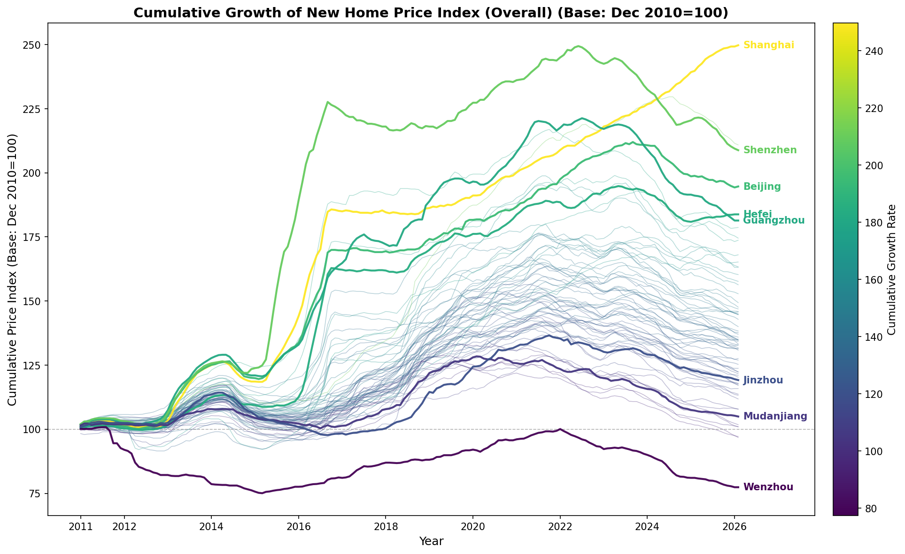
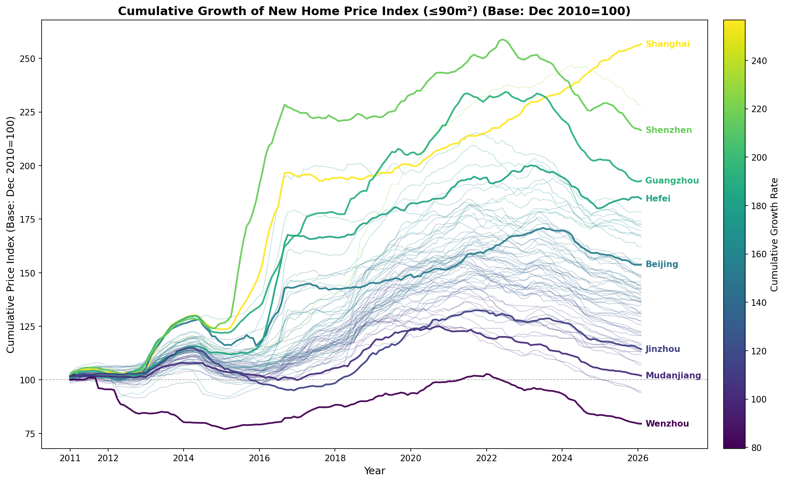
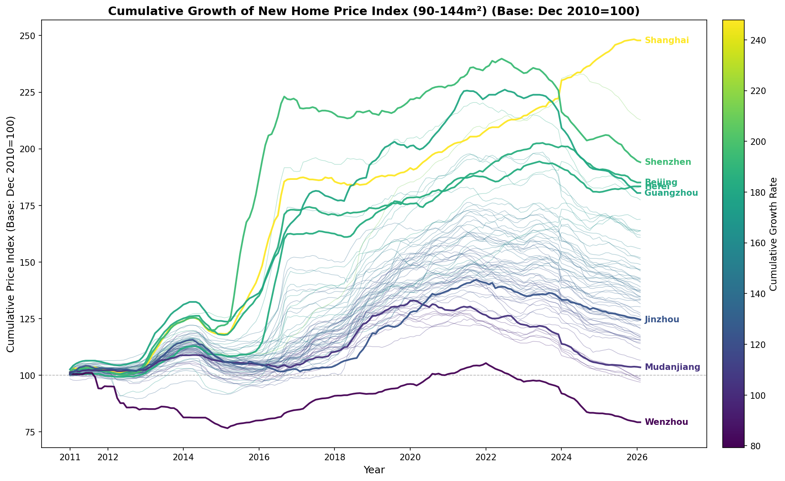
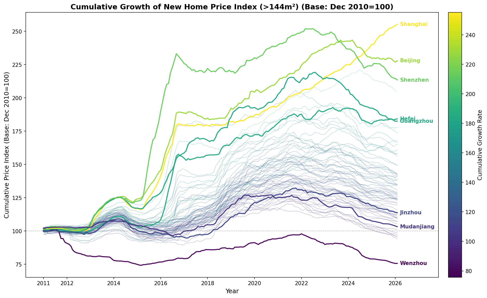
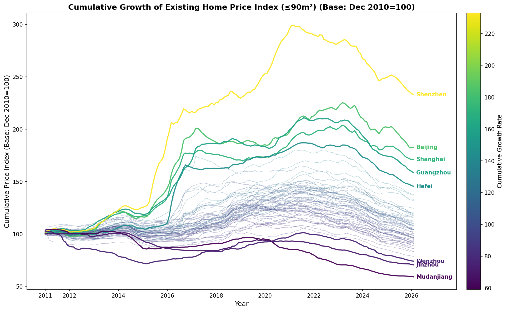
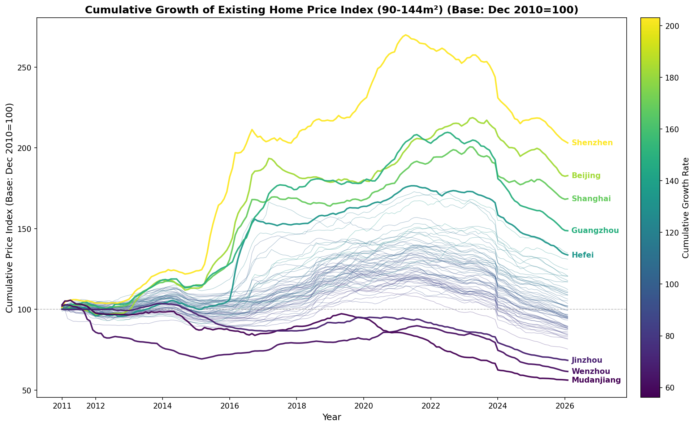
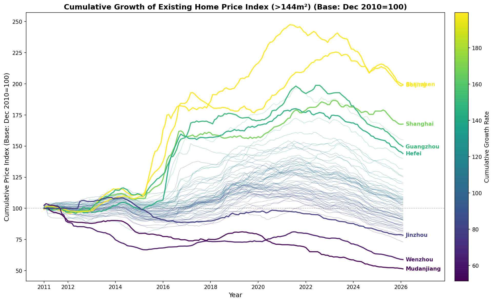

# 70 China Cities Housing Index Data

Monthly housing price index data for 70 major Chinese cities, published by the National Bureau of Statistics of China. Collected and cleaned by Chang Gao.

(Easy to see, the new housing price index for Shanghai looks a bit strange here, the existing home ones look to be fine.)

**Coverage: 2011.1 - Current Month**

## Data Description

The dataset (`merged_housing_data_eng.csv`) contains monthly residential housing (商品住宅) price indices (month-on-month, previous month = 100) for 70 cities across 8 indicators:

| Column | Description |
|---|---|
| `new_home_price_index` | New residential housing price index (overall) |
| `existing_home_price_index` | Existing residential housing price index (overall) |
| `new_small_home_index` | New residential, 90m² or smaller |
| `new_medium_home_index` | New residential, 90-144m² |
| `new_large_home_index` | New residential, larger than 144m² |
| `existing_small_home_index` | Existing residential, 90m² or smaller |
| `existing_medium_home_index` | Existing residential, 90-144m² |
| `existing_large_home_index` | Existing residential, larger than 144m² |

## Cumulative Growth Charts

All charts use Dec 2010 = 100 as the base. Updated automatically each month.

### New Residential Housing









### Existing Residential Housing








## Automated Monthly Updates

A GitHub Actions workflow runs on the 28th of each month to automatically:

1. Fetch new data pages from [stats.gov.cn](https://www.stats.gov.cn/sj/zxfb/)
2. Parse the HTML tables and extract month-on-month indices
3. Append new rows to the CSV, regenerate plots, and commit

The workflow can also be triggered manually from the Actions tab.

## Manual Update

To update manually:

```bash
# Fetch new HTML from stats.gov.cn
python3 add_data/fetch_new_data.py

# Parse and append to CSV
python3 add_data/update_data.py

# Regenerate plots
python3 plot_cumulative_growth.py
```

Or place HTML files manually as `add_data/YYYYMM.html` and run `update_data.py`. Duplicate months are automatically skipped.
