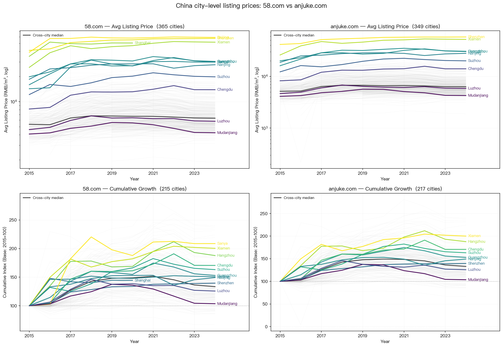

# 70 China Cities Housing Index Data

Monthly housing price index data for 70 major Chinese cities, published by the National Bureau of Statistics of China. Collected and cleaned by Chang Gao.

(Easy to see, the new housing price index for Shanghai looks a bit strange here, the existing home ones look to be fine.)

**Coverage: 2011.1 - Current Month**

## Data Description

The dataset (`merged_housing_data_eng.csv`) contains monthly residential housing (商品住宅) price indices (month-on-month, previous month = 100) for 70 cities across 8 indicators:

| Column | Description |
|---|---|
| `new_home_price_index` | New residential housing price index (overall) |
| `existing_home_price_index` | Existing residential housing price index (overall) |
| `new_small_home_index` | New residential, 90m² or smaller |
| `new_medium_home_index` | New residential, 90-144m² |
| `new_large_home_index` | New residential, larger than 144m² |
| `existing_small_home_index` | Existing residential, 90m² or smaller |
| `existing_medium_home_index` | Existing residential, 90-144m² |
| `existing_large_home_index` | Existing residential, larger than 144m² |

## Price Drop from Peak

<!-- STATS_START -->
_As of 2026-04. Peak = each city's all-time high cumulative index since Dec 2010 (base=100). Drop is expressed as a negative percent; 0% means the city is still at its peak._

| Metric | New Home | Existing Home |
|---|---|---|
| Avg drop, 30 worst-hit cities | -20.05% | -28.74% |
| Avg drop, all cities (69 / 70) | -15.25% | -24.28% |
| Biggest drop | **Luzhou** -25.86% (peak 2019-05) | **Mudanjiang** -44.14% (peak 2011-04) |
| Smallest drop | **Hangzhou** 0.00% (peak 2025-10) | **Shanghai** -13.32% (peak 2023-03) |

_New Home stats exclude Shanghai due to known data anomalies._
<!-- STATS_END -->

## Growth at Price Peak

<!-- GROWTH_START -->
_As of 2026-04. Growth at price peak = each city's cumulative growth from Dec 2010 (base=100, period 0) to its all-time peak. Measures how much prices rose at each city's highest point relative to the start of the series._

| Metric | New Home | Existing Home |
|---|---|---|
| Avg growth at price peak, 30 top-growth cities | +83.67% | +59.84% |
| Avg growth at price peak, all cities (69 / 70) | +60.37% | +38.97% |
| Biggest growth at price peak | **Shenzhen** +149.42% (peak 2022-06) | **Shenzhen** +178.88% (peak 2021-03) |
| Smallest growth at price peak | **Wenzhou** +0.80% (peak 2011-07) | **Jinzhou** +2.21% (peak 2014-04) |

_New Home stats exclude Shanghai due to known data anomalies._
<!-- GROWTH_END -->

See [stats.md](stats.md) / [stats.json](stats.json) for the same numbers plus per-city detail (both drop and growth).

## Cumulative Growth Charts

All charts use Dec 2010 = 100 as the base. Updated automatically each month.

### New Residential Housing


### Existing Residential Housing


## Supplementary Data

The [supplementary/](supplementary/) folder contains annual average listing prices (RMB/m²) scraped from two popular Chinese real-estate platforms. They complement the NBS index data by providing absolute price levels and wider city coverage (~350 cities vs. 70). Useful for anchoring the index to real prices or for cross-validation.

| File | Source | Cities | Years |
|---|---|---|---|
| [58tongcheng_city_avg_price_annual_2010-2024.csv](supplementary/58tongcheng_city_avg_price_annual_2010-2024.csv) | 58.com | 365 | 2010-2024 |
| [anjuke_city_avg_price_annual_2015-2024.csv](supplementary/anjuke_city_avg_price_annual_2015-2024.csv) | anjuke.com | 349 | 2015-2024 |

Columns: `province`, `city`, `year`, `price_yuan_per_sqm`, `yoy_pct` (year-over-year % change, computed from `price_yuan_per_sqm`; blank for each city's first year).

A single 2×2 overview compares the two platforms across every city in each dataset. Columns = source (58.com / anjuke.com), rows = view (absolute price in RMB/m² on log scale / cumulative growth with 2015 = 100). All cities render as a faint grey "cloud"; the cross-city median is overlaid as a dark reference line; ~12 strategic cities are highlighted in color with English labels. Cumulative panels only include cities with 2015 data. Regenerate with `python3 supplementary/plot_listing_prices.py`.



## Automated Monthly Updates

A GitHub Actions workflow runs on the 28th of each month to automatically:

1. Fetch new data pages from [stats.gov.cn](https://www.stats.gov.cn/sj/zxfb/)
2. Parse the HTML tables and extract month-on-month indices
3. Append new rows to the CSV, regenerate plots, and commit

The workflow can also be triggered manually from the Actions tab.

## Manual Update

To update manually:

```bash
# Fetch new HTML from stats.gov.cn
python3 add_data/fetch_new_data.py

# Parse and append to CSV
python3 add_data/update_data.py

# Regenerate plots
python3 plot_cumulative_growth.py
```

Or place HTML files manually as `add_data/YYYYMM.html` and run `update_data.py`. Duplicate months are automatically skipped.
